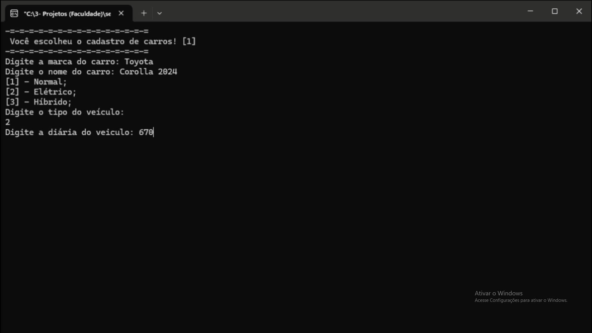
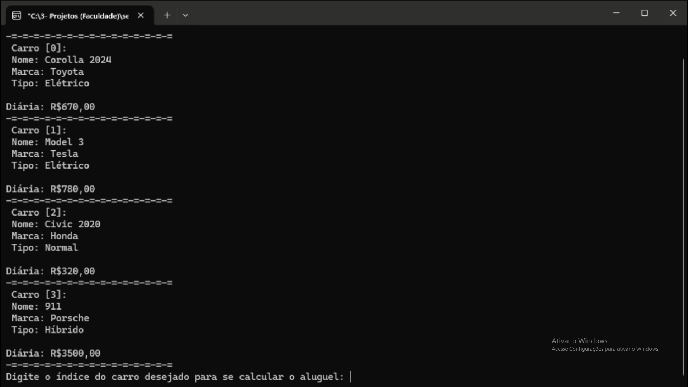

# Locadora de Veiculos

Aplicação structs e listas para organizar as informações e interage com o usuário por meio de um menu simples no terminal. Um projeto realizado por um grupo de alunos cursando o 2º período da faculdade UNIPÊ:

## 📌 Integrantes envolvidos no projeto:

 - [Cauã Augusto Machado de Negreiros](https://github.com/cauaaugustow)
 - [Ryan Emanuel Lima Miranda](https://github.com/ryanlimaw)
 - [Leonardo Lucas de Brito Silva](https://github.com/leonardolucasbs)
 - [Lucca de Sena Barbosa](https://github.com/luccasena)
 - [Maximus Feitoza Lira Cunha](https://github.com/MaxFeitoza)

## 📌 Imagens Demonstrativas do Algoritmo: 

### 1. Menu:

### 2. Registros de Carros:

### 3. Carros após serem registrados:

